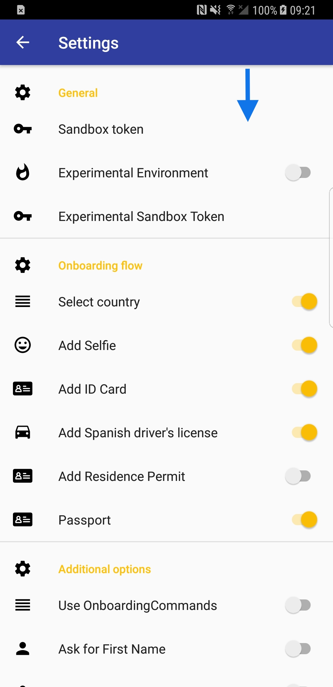

# onboarding-android  [![Release]https://img.shields.io/maven-metadata/v?metadataUrl=https%3A%2F%2Falicebiometrics.jfrog.io%2Fartifactory%2Falicebiometrics-maven-pro-local%2Fcom%2Falicebiometrics%2Fonboarding%2FAliceOnboarding%2Fmaven-metadata.xml](https://github.com/alice-biometrics/onboarding-android/releases) [](https://docs.alicebiometrics.com/onboarding/) [](https://docs.alicebiometrics.com/onboarding/sdk/android/)


ALiCE Onboarding Android component allows the automatic capture of documents and video selfie of the user in real time from the camera of your device. It also simplifies the communication with the onboarding API to facilitate rapid integration and development. It manages the onboarding flow configuration: requested documents and order.

The main features are:

- Automatic capture of documents and video selfie of the user in real time from the camera of your device.
- Communication with the onboarding API to facilitate rapid integration and development.
- Manage the onboarding flow configuration: requested documents and order.

## Table of Contents
- [Requirements](#requirements)
- [Installation :computer:](#installation-computer)
- [Getting Started :chart_with_upwards_trend:](#getting-started-chart_with_upwards_trend)
  * [Permissions](#permissions)
  * [Onboarding](#onboarding)
  * [Onboarding with Commands](#onboarding-with-commands)
- [Authentication :closed_lock_with_key:](#authentication-closed_lock_with_key)
  * [Trial](#trial)
  * [Production](#production)
- [Demo :rocket:](#demo-rocket)
- [Troubleshooting :fire:](#troubleshooting-fire)
- [Customisation :gear:](#customisation-gear)
- [Documentation :page_facing_up:](#documentation-page_facing_up)
- [Contact :mailbox_with_mail:](#contact-mailbox_with_mail)


## Requirements

All versions of Android are supported since Android 5.0 (sdk 21).

## Installation :computer:


### Our configuration

```gradle
minSdkVersion = 21
targetSdkVersion = 29
compileSdkVersion = 29
Kotlin = 1.3.60
```

### Adding the SDK dependency

```gradle
repositories {
    jcenter()
    maven {
        url  "https://alicebiometrics.jfrog.io/artifactory/alicebiometrics-maven-pro-local/" 
    }
}
```

```gradle
dependencies {
    implementation 'com.alicebiometrics.onboarding:AliceOnboarding:+'
}
```


## Getting Started :chart_with_upwards_trend:

You can integrate the onboarding process in two different ways: using a pre-configured flow, through the `Onboarding` class, or creating a manual flow, through the `OnboardingCommands` class.

In the first case, you simply need to indicate to the SDK the flow you want: number and type of documents, order, etc. From this configuration, the SDK takes control and allows you to perform the entire onboarding process autonomously without having to worry about managing ALiCE Onboarding API calls. This is the fastest and easiest way to integrate the onboarding process in your application.

In the second case, no flow is specified. The onboarding process is completely free, allowing your application to manage the beginning and end of it, as well as the capture and upload of the different documents to the API. This case is indicated for an expert level of configuration, allowing you to split the onboarding process into different stages and add other tasks related to your customer flow (e.g. a form to be filled in by the user).

### Permissions

ALiCE Onboarding needs to have the following permissions granted.

```kotlin
  <uses-permission android:name="android.permission.CAMERA" />
  <uses-permission android:name="android.permission.WRITE_EXTERNAL_STORAGE" />
```

### Onboarding

##### Configuration

You can configure the onboarding flow with the following code:

```kotlin
val userToken = "<ADD-YOUR-USER-TOKEN-HERE>"

val config = OnboardingConfig.builder()
  .withUserToken(userToken)
  .withAddSelfieStage()
  .withAddDocumentStage(type = DocumentType.IDCARD, issuingCountry = "ESP")
  .withAddDocumentStage(type = DocumentType.DRIVERLICENSE, issuingCountry = "ESP")
  .withAddDocumentStage(type = PASSPORT)

```

Where `userToken` is used to secure requests made by the users on their mobile devices or web clients. You should obtain it from your Backend (see [Authentication :closed_lock_with_key:](#authentication-closed_lock_with_key)).


##### Run ALiCE Onboarding

Once you configured the ALiCE Onboarding Flow, you can run the process with:

```kotlin
val onboarding = Onboarding(this, config: config)
    onboarding.run(ONBOARDING_REQUEST_CODE)
    }
}

...

override fun onActivityResult(requestCode: Int, resultCode: Int, data: Intent?) {
    super.onActivityResult(requestCode, resultCode, data)
        if (requestCode == ONBOARDING_REQUEST_CODE) {
            if (resultCode == Activity.RESULT_OK) {
                val userInfo = data!!.getStringExtra("userStatus")
        } else if (resultCode == Activity.RESULT_CANCELED) {
        
        }
    }
}
```

### Onboarding with Commands
 
You can configure and run specific actions with the class `OnboardingCommands`. 
This mode allows you to use the following commands:
* `addSelfie`: Presents a Selfie Capturer and uploads this info to ALiCE Onboarding.
* `createDocument`: Creates a document (`DocumentType`, `DocumentIssuingCountry`). It returns a `DocumentId`.
* `addDocument`: Adds document Side. It requires as input a valid `DocumentId`, `DocumentSide`, `DocumentType` and `DocumentIssuingCountry`.
* `getUserStatus`: Returns information about the User.
* `authenticate`: Presents a Selfie Capturer and verifies the identity of the enrolled user. User must be authorized to use this command.
* `getDocumentsSupported`: Returns a map with information about supported documents in ALiCE Onboarding.


First of all, you have to configure an `OnboardingCommand` instance:

```swift
val onboardingCommands = OnboardingCommands(this, userToken)
```

Once you configured the `OnboardingCommands`, you can run the selected process with:

##### Run Selfie Capturer

```kotlin
class OnboardingCommandActivity : AppCompatActivity() {

    private val ONBOARDINGCOMMANDS = "ONBOARDING_COMMANDS"
    private val REQUEST_CODE_ADD_FACE = 100
    private lateinit var onboardingCommands: OnboardingCommands

    override fun onCreate(savedInstanceState: Bundle?) {
        super.onCreate(savedInstanceState)
        setContentView(R.layout.activity_onboarding_command)
        onboardingCommands = OnboardingCommands(this, intent.getStringExtra("userToken"))
    }

    fun commandAddSelfie(view: View) {
        onboardingCommands.addSelfie(requestCode=REQUEST_CODE_ADD_FACE)
    }

    override fun onActivityResult(requestCode: Int, resultCode: Int, data: Intent?) {
        super.onActivityResult(requestCode, resultCode, data)
        if (requestCode == REQUEST_CODE_ADD_FACE) {
            when(val result: OnboardingCommandResult = data!!.getParcelableExtra("onboardingCommandResult")){
                is OnboardingCommandResult.Success -> {
                    showDialog(result.response.content)
                }
                is OnboardingCommandResult.Failure -> {
                    handleOnboardingError(result.response)
                }
            }
        }
    }
```

##### Run Document Capturer

```kotlin
class OnboardingCommandActivity : AppCompatActivity() {

    private val REQUEST_CODE_ADD_DOCUMENT = 200
    private lateinit var onboardingCommands: OnboardingCommands

    override fun onCreate(savedInstanceState: Bundle?) {
        super.onCreate(savedInstanceState)
        setContentView(R.layout.activity_onboarding_command)
        onboardingCommands = OnboardingCommands(this, intent.getStringExtra("userToken"))
    }

    fun commandAddDocument(view: View) {
       val documentype = DocumentType.IDCARD
       val documentCountry = "ESP"
       onboardingCommands.createDocument(documentype, documentCountry) { result ->
           when (result) {
               is OnboardingCommandResult.Success -> {
                   onboardingCommands.addDocument(
                           documentId = result.response.content,
                           type =  documentype,
                           issuingCountry = documentCountry,
                           side = DocumentSide.FRONT,
                           requestCode=REQUEST_CODE_ADD_DOCUMENT)
               }
               is OnboardingCommandResult.Failure  -> {
                   showDialog(result.response.toString())
               }
           }
       }
    }
    
    override fun onActivityResult(requestCode: Int, resultCode: Int, data: Intent?) {
      super.onActivityResult(requestCode, resultCode, data)
      if (requestCode == REQUEST_CODE_ADD_DOCUMENT) {
          when(val result: OnboardingCommandResult = data!!.getParcelableExtra("onboardingCommandResult")){
              is OnboardingCommandResult.Success -> {
                  showDialog(result.response.content)
              }
              is OnboardingCommandResult.Failure -> {
                  handleOnboardingError(result.response)
              }
          }
      }
    }
}
```

Check an example of this in the [AppOnboardingSample](https://github.com/alice-biometrics/onboarding-android/blob/master/AppOnboardingSample/app/src/main/java/com/alicebiometrics/apponboardingsample/OnboardingCommandActivity.kt) application.

## Authentication :closed_lock_with_key:

How can we get the `userToken` to start testing ALiCE Onboarding technology?

`AliceOnboarding` can be used with two different authentication modes:

* Trial (Using ALiCE Onboarding Sandbox): Recommended only in the early stages of integration.
    - Pros: This mode does not need backend integration.
    - Cons: Security compromises. It must be used only for develpment and testing.
* Production (Using your Backend): In a production deployment we strongly recommend to use your backend to obtain required TOKENS.
    - Pros: Full security level. Only your backend is able to do critical operations.
    - Cons: Needs some integration in your backend.

### Trial

If you want to test the technology without integrate it with your backend, you can use our Sandbox Service. This service associates a user mail with the ALiCE Onboarding `user_id`. You can create a user and obtain his `USER_TOKEN` already linked with the email.

Use the `SandboxAuthenticator` class to ease the integration.

```kotlin
val sandboxToken = "<ADD-YOUR-SANDBOX-TOKEN-HERE>"
val userInfo = UserInfo(email = email, // required
                        firstName = firstName, // optional 
                        lastName = lastName)  // optional 
                        
val authenticator = SandboxAuthenticator(sandboxToken = sandboxToken, userInfo = userInfo)

authenticator.execute { response ->
    when (response) {
        is Response.Success -> {
          // Configure ALiCE Onboarding with the OnboardingConfig
          // Then Run the ALiCE Onboarding Flow
        }
        is Response.Failure -> {
          // Inform the user about Authentication Errors
        }
    }
}
```

Where `sandboxToken` is a temporary token for testing the technology in a development/testing environment. 

An `email` parameter in `UserInfo` is required to associate it to an ALiCE Onboarding `user_id`. You can also add some additional information from your user as `firstName` and `lastName`.

For more information about the Sandbox, please check the following [doc](https://docs.alicebiometrics.com/onboarding/access.html#using-alice-onboarding-sandbox).

### Production

On the other hand, for production environments we strongly recommend to use your backend to obtain the required `USER_TOKEN`.

You can implement the `Authenticator` interface available in the `AliceOnboarding` library.

```kotlin
class MyBackendAuthenticator : Authenticator {


    override fun execute(callback: (Response) -> Unit) {

        // Add here your code to retrieve the user token from your backend

        val userToken = "fakeUserToken"
        callback(Response.Success(userToken))
    }

}
```

In a very similar way to the authentication available with the sandbox:

```kotlin
                        
val authenticator = MyBackendAuthenticator()

authenticator.execute { response ->
    when (response) {
        is Response.Success -> {
          // Configure ALiCE Onboarding with the OnboardingConfig
          // Then Run the ALiCE Onboarding Flow
        }
        is Response.Failure -> {
          // Inform the user about Authentication Errors
        }
    }
}
```


## Demo :rocket:

Check our Android demo in this repo (`AppOnboardingSample` folder). 

To run the project:

* Open the Android Studio Project
* Run the application.

#### App

Add your `SANDBOX_TOKEN` credentials in `Settings -> General -> Sandbox Token` 



## Customisation :gear:


Please, visit the doc.

https://docs.alicebiometrics.com/onboarding/sdk/android/customisation.html

## Troubleshooting :fire:

#### Write permission not granted

```
java.lang.IllegalStateException
        at android.media.MediaRecorder.stop(Native Method)
        at com.alicebiometrics.onboarding.camera.AliceCaptureCamera.stopRecordVideo(AliceCaptureCamera.java:509)
        at com.alicebiometrics.onboarding.activities.SelfieCapturerActivity.stopRecordVideoCamera(SelfieCapturerActivity.kt:136)
        at com.alicebiometrics.onboarding.activities.SelfieCapturerActivity.access$stopRecordVideoCamera(SelfieCapturerActivity.kt:38)
        at com.alicebiometrics.onboarding.activities.SelfieCapturerActivity$updateFaceCounter$runnable$1.run(SelfieCapturerActivity.kt:118)
        at android.os.Handler.handleCallback(Handler.java:883)
        at android.os.Handler.dispatchMessage(Handler.java:100)
```

Please, grant write permission. Check [Permissions](#permissions)

<uses-permission android:name="android.permission.WRITE_EXTERNAL_STORAGE" />

This permission is necessary because the android MediaRecorder utility used to record the video clip writes the output to disk.

#### java.lang.ExceptionInInitializerError on launch (versions >= 1.5.1)

If you are using versions greather than or equal to 1.5.1 and the application crashes on launch and the trace it's like this:

```
Caused by java.lang.ExceptionInInitializerError
       at kotlin.reflect.jvm.internal.impl.builtins.DefaultBuiltIns.getInstance(DefaultBuiltIns.java)
       at kotlin.reflect.jvm.internal.impl.types.ErrorUtils$1.getBuiltIns(ErrorUtils.java:139)
       at kotlin.reflect.jvm.internal.impl.resolve.descriptorUtil.DescriptorUtilsKt.getBuiltIns(Descriptor
       ....
Caused by: java.lang.IllegalStateException: No BuiltInsLoader implementation was found. Please ensure that the META-INF/services/ is not stripped from your application and that the Java virtual machine is not running under a security manager
```
The error is caused by proguard. You can fix this by adding these new rules:

```
-keep interface kotlin.reflect.jvm.internal.impl.builtins.BuiltInsLoader
-keep class kotlin.reflect.jvm.internal.impl.serialization.deserialization.builtins.BuiltInsLoaderImpl
```

This will be fixed on future versions of the library since it's already [fixed on the upstream of the faulty dependency](https://github.com/JetBrains/kotlin/pull/2893).

## Documentation :page_facing_up:

For more information about ALiCE Onboarding:  https://docs.alicebiometrics.com/onboarding/

## Contact :mailbox_with_mail:

support@alicebiometrics.com
